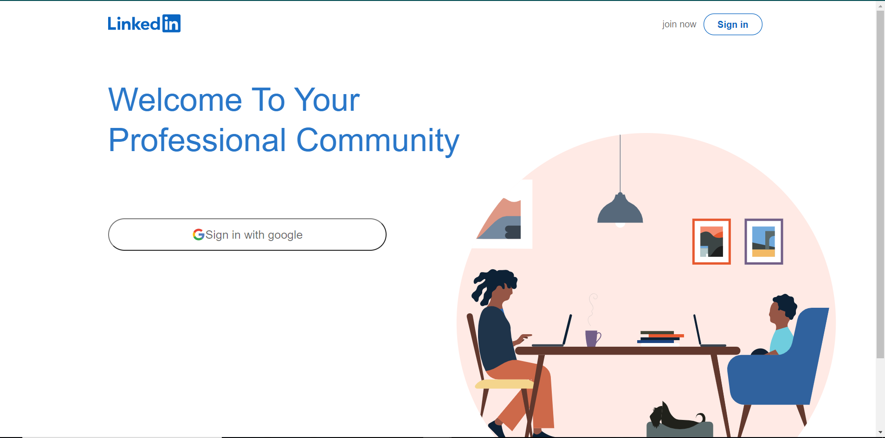
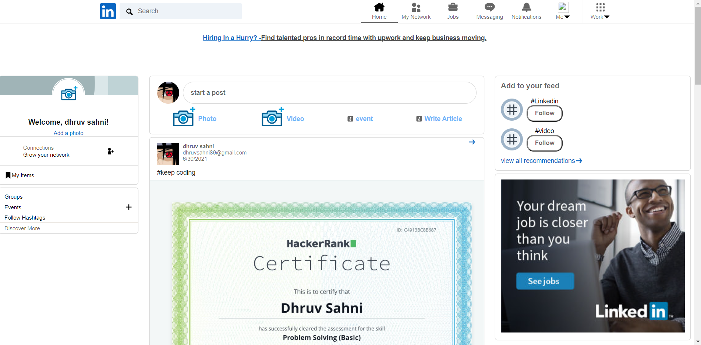
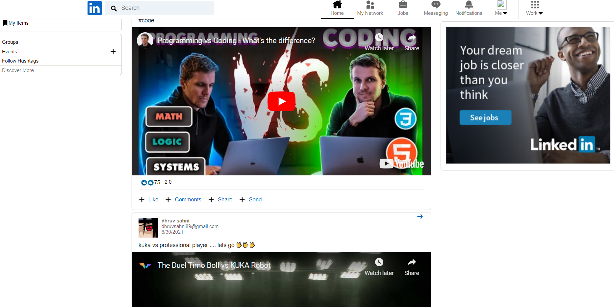
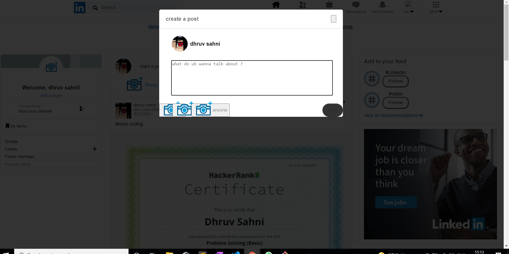

# LinkedIn-clone

  
  
  
 

linked-in clone using react , redux and firebase 

## login page
  
***
  
   ## feed Page

***
  
  
   ## feed showing video player

***
  
   ## create post

***
